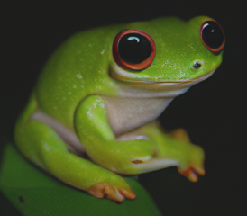

# MaskGIT PyTorch

[](https://github.com/Manvith-Prabhu/MaskGIT4retina.git)
[](https://colab.research.google.com/github/valeoai/MaskGIT-pytorch/blob/main/colab_demo.ipynb)
[](LICENSE.txt)


Welcome to the unofficial MaskGIT PyTorch repository. 
This project aims to provide an external reproduction of the results from [MaskGIT: Masked Generative Image Transformer](https://arxiv.org/abs/2202.04200), a PyTorch reimplementation of the models, and pretrained weights.
Official JAX implementation of MaskGIT can be found [here](https://github.com/google-research/maskgit).

## Repository Structure

Here's an overview of the repository structure:
  
      ├ MaskGIT-pytorch/
      |    ├── Metrics/                               <- evaluation tool
      |    |      ├── inception_metrics.py                  
      |    |      └── sample_and_eval.py
      |    |    
      |    ├── Network/                             
      |    |      ├── Taming/                         <- VQGAN architecture   
      |    |      └── transformer.py                  <- Transformer architecture  
      |    |
      |    ├── Trainer/                               <- Main class for training
      |    |      ├── trainer.py                      <- Abstract trainer     
      |    |      └── vit.py                          <- Trainer of maskgit
      |    ├── save_img/                              <- Image samples         
      |    |
      |    ├── colab_demo.ipynb                       <- Inference demo 
      |    ├── download_models.py                     <- download the pretrained models
      |    ├── LICENSE.txt                            <- MIT license
      |    ├── requirements.yaml                      <- help to install env 
      |    ├── README.md                              <- Me :) 
      |    └── main.py                                <- Main
      |    └── runscript.sh                           <- bash file to run maskgit code
      

## Usage

To get started with this project, follow these steps:

1. Clone the repository:

   ```bash
   git clone https://github.com/valeoai/MaskGIT-pytorch.git
   cd MaskGIT-pytorch

2. Install requirement 

   ```bash
   conda env create -f environment.yaml
   conda activate maskgit

3. Download the ODIR-5k dataset from Kaggle. Arrange the dataset according to the requirements of ImageFolder API available on Pytorch.

4. (Optional) Download models pretrained on ImageNET:

   ```bash
   python download_models.py

5. to train from scratch, train the VQ-VAE using:

   ```bash
   python main.py --train_config vq_vae

6. Once the VQ-VAE is trained proceed to train MaskGIT after commenting following line of code in main.py:
   ```bash
   # vq_gan.fit()
   
7. Train the MaskGIIT usinng:
   ```bash
   bash runscript.sh

8. to test VQVAE and MaskGIT:
   VQ-VAE:
   ```bash
   python ./Trainer/test_vq_gan.py
   ```
   MaskGIT:
   ```bash
   python ./Trainer/test_vit.py
   ```   

## Demo

You are interested only in the inference of the model? You can run the demo_colab.ipynb in google collab! [](https://colab.research.google.com/github/valeoai/MaskGIT-pytorch/blob/main/colab_demo.ipynb) - implemented for ImageNEt and not for Retinal Scans

## Training Details

The model consists of a total of 246.303M parameters, with 174.161M for the transformer and 72.142M for VQGAN.
The VQGAN reduces a 256x256 image to a 16x16 token representation, over a bank of 4096 possible codes.
During the masked transformer training, I used a batch size of 32 over 100 epochs, leveraging a single GPU ( on Nvidia A100) on ODIR-5k 256x256.
ODIR-5k dataset is avilable publicly on [Kaggle](https://www.kaggle.com/datasets/andrewmvd/ocular-disease-recognition-odir5k)

The transformer architecture hyperparameters:

| Hidden Dimension | Codebook Size | Depth | Attention Heads | MLP Dimension | Dropout Rate |
|------------------|---------------|-------|-----------------|---------------|--------------|
| 768              | 4096          | 24    | 16              | 3072          | 0.0          |

The optimizer employed is Adam with a learning rate of 1e-4, utilizing an 'arccos' scheduler for masking. Additionally, during training, I applied a 0% dropout for the CFG.

For all the details, please refer to our [technical report](https://arxiv.org/abs/2310.14400v1)


## Pretrained Model

You can download the pretrained ImageNET MaskGIT models in [hugging face](https://huggingface.co/llvictorll/Maskgit-pytorch/tree/main).

## Contribute

The reproduction process might encounter bugs or issues, or there could be mistakes on my part. If you're interested in collaborating or have suggestions, please feel free to reach out. Your input and collaboration are highly valued!

## License

This project is licensed under the MIT License. See the [LICENSE](LICENSE.txt) file for details.

## Acknowledgement

This project is powered by NUS HPC cluster located in Singapore and NUS-A100 server located in China. 
There is a lot of scope for improvement of quality of image generated and we are working on it!

The pretrained VQGAN ImageNet (f=16), 1024 codebook. The implementation and the pre-trained model is coming from the [VQGAN official repository](https://github.com/CompVis/taming-transformers/tree/master). But for our project the codebook size is changed to 4096.
